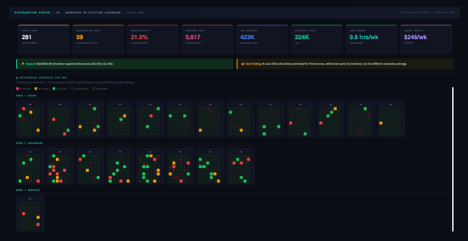

# Warehouse Slotting Optimization Tool

🔗 Live Demo: https://warehouse-slotting-dashboard-d7mn4sgqs5bx9fdnp2wmei.streamlit.app
💻 GitHub: https://github.com/solongo5/warehouse-slotting-dashboard

End-to-end warehouse analytics solution designed to identify SKU misalignment, prioritize relocation actions, and improve warehouse slotting decisions using SQL, Python, and Streamlit.

> **Note:** This project is based on a real warehouse optimization use case. All data has been anonymized and simulated due to confidentiality requirements.

---

# Dashboard Preview



---

# Business Problem

Warehouse slotting directly impacts picking efficiency, labor utilization, and throughput.

In many warehouse environments:

* High-demand SKUs are not stored in optimal locations
* Prime picking locations are occupied by lower-priority inventory
* Relocation decisions are often reactive rather than data-driven
* No standardized prioritization exists for warehouse re-slotting

These conditions can increase picker travel time, reduce productivity, and limit warehouse efficiency.

---

# Objective

Develop a data-driven warehouse slotting solution to:

* Identify inventory location misalignment
* Classify inventory based on business importance and movement velocity
* Prioritize relocation opportunities
* Recommend optimal warehouse zones
* Support warehouse decision-making through interactive dashboards

---

# Methodology

## 1. Data Preparation

Warehouse inventory, location, and movement data were processed using Azure SQL and Python.

Key datasets included:

* Inventory master data
* Warehouse location assignments
* Material movement history
* Stock quantities
* Warehouse zone definitions

---

## 2. ABC Classification

SKUs were classified according to outbound inventory contribution.

### A Class

Highest-value inventory contributing the largest share of outbound volume.

### B Class

Moderate-value inventory.

### C Class

Lower-value inventory with reduced operational impact.

This classification helps prioritize warehouse space allocation based on business value.

---

## 3. Speed Classification

Movement velocity was calculated using historical outbound transactions.

### Fast

40+ issue events

### Medium

10–39 issue events

### Slow

Fewer than 10 issue events

This approach identifies which products are picked most frequently.

---

## 4. Slotting Logic

ABC classification and Speed classification were combined to determine recommended warehouse placement.

Examples:

| ABC | Speed  | Recommended Zone     |
| --- | ------ | -------------------- |
| A   | Fast   | Prime                |
| A   | Medium | Prime                |
| B   | Fast   | Prime                |
| B   | Medium | Secondary            |
| C   | Slow   | Secondary / Overflow |

This allows warehouse space to be aligned with operational demand.

---

# Key Results

* 528 total SKUs analyzed
* 160 comparable finished-goods SKUs evaluated
* 108 relocation candidates identified
* 20.5% relocation rate across inventory
* 67.5% of analyzed SKUs found outside recommended zones
* 20 high-priority A/Fast SKUs identified outside Prime locations
* 29 lower-priority SKUs occupying Prime warehouse space

---

# Dashboard Features

## Executive KPI Dashboard

Tracks:

* Total SKUs
* Comparable SKUs
* Relocation candidates
* Relocation rate
* Misalignment percentage
* High-priority inventory outside Prime zones

---

## Relocation Prioritization

Identifies:

* High Priority moves
* Medium Priority moves
* Low Priority moves

Includes:

* Top relocation opportunities
* Downloadable relocation action list
* Priority-based filtering

---

## Zone Flow Analysis

Visualizes:

* Current warehouse placement
* Recommended placement
* Prime-to-secondary movement opportunities
* Secondary-to-prime movement opportunities

Helps quantify warehouse re-slotting requirements.

---

## Warehouse Map Visualization

Interactive warehouse map displaying:

* Current inventory distribution
* Warehouse lanes
* Zone occupancy
* Recommended slotting assignments

Provides a visual representation of warehouse optimization opportunities.

---

# Technology Stack

### Data Engineering

* Azure SQL
* SQL Views
* Data Modeling

### Analytics

* Python
* Pandas
* NumPy

### Visualization

* Streamlit
* Plotly
* Interactive Dashboards

### Supply Chain Techniques

* ABC Analysis
* Velocity Analysis
* Slotting Optimization
* Warehouse Analytics
* Inventory Segmentation

---

# Project Architecture

1. Extract warehouse inventory and movement data
2. Calculate ABC classifications
3. Calculate Speed classifications
4. Generate slotting recommendations
5. Identify relocation opportunities
6. Prioritize actions based on business impact
7. Visualize results through Streamlit dashboards

---

# Business Impact

The solution provides a structured framework for warehouse re-slotting decisions by:

* Improving inventory placement visibility
* Prioritizing high-impact relocation opportunities
* Supporting warehouse labor efficiency
* Reducing picker travel distance
* Increasing utilization of Prime warehouse space
* Enabling data-driven warehouse optimization

---

# Repository Structure

```text
warehouse-slotting-dashboard/
│
├── app.py
├── requirements.txt
├── README.md
├── images/
│   └── dashboard.png
│
└── data/
    └── simulated_data.csv
```

---

# Disclaimer

This project is intended for portfolio and educational purposes only.

The original business use case was adapted from a warehouse optimization project. All data, identifiers, and operational details have been anonymized and/or simulated to protect confidential information.
